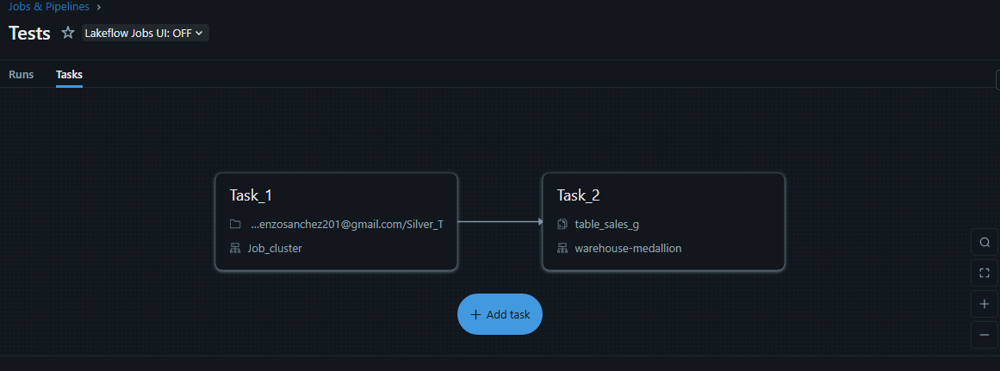
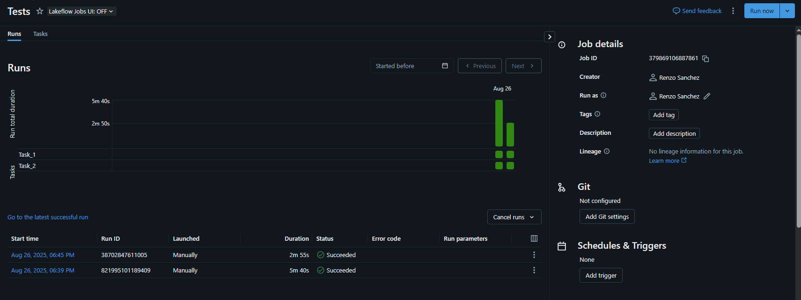
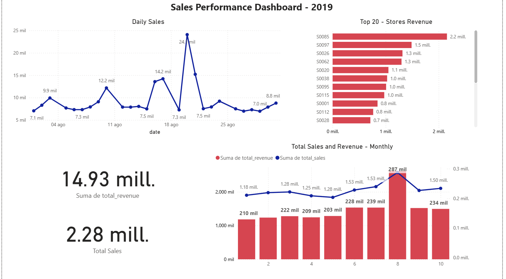

# Databricks Sales Pipeline

## Overview
Este proyecto implementa un **pipeline ETL/ELT en Databricks** bajo la **arquitectura Medallion (Bronze–Silver–Gold)**. Utiliza un dataset de ventas para simular el flujo completo de ingestión, limpieza, transformación y visualización en Power BI.  

Objetivos:  
- Ingestar datos raw desde CSV (Bronze).  
- Estandarizar y limpiar en tablas intermedias (Silver).  
- Generar métricas de negocio (Gold).  
- Visualizar ventas, stock y promociones en dashboards.  

---

## Dataset

| Column                | Type    | Description                    |
|-----------------------|---------|--------------------------------|
| product_id            | string  | Identificador de producto      |
| store_id              | string  | Identificador de tienda        |
| date                  | date    | Fecha de transacción           |
| sales                 | double  | Unidades vendidas              |
| revenue               | double  | Ingresos generados             |
| stock                 | double  | Inventario disponible          |
| price                 | double  | Precio del producto            |
| promo_type_1          | string  | Tipo de primera promoción      |
| promo_bin_1           | string  | Bandera de primera promoción   |
| promo_type_2          | string  | Tipo de segunda promoción      |
| promo_bin_2           | string  | Bandera de segunda promoción   |
| promo_discount_2      | double  | Descuento aplicado (%)         |
| promo_discount_type_2 | string  | Tipo de descuento aplicado     |

---

## Technologies
- **Databricks** (PySpark, SQL, Delta Lake)  
- **AWS S3** (almacenamiento raw)  
- **Power BI** (visualización de KPIs)  
- **GitHub** (documentación y control de versiones)  

---

## Pipeline
1. **Bronze:** Ingesta raw desde S3.  
2. **Silver:** Limpieza, formato de fechas y estandarización.  
3. **Gold:** Tablas de negocio (ventas, ingresos, promociones).  
4. **Dashboards:** Análisis de ventas, stock y efectividad promocional.  

---

## Screenshots

### Pipeline en Databricks
  
  

### Dashboard de Ventas (Power BI)
  

---

## Author
**Renzo Gabriel Sánchez Quispe**  
Lima, Perú  
Correo: renzosanchez201@gmail.com  
🔗 [GitHub](https://github.com/renzosan25)  
