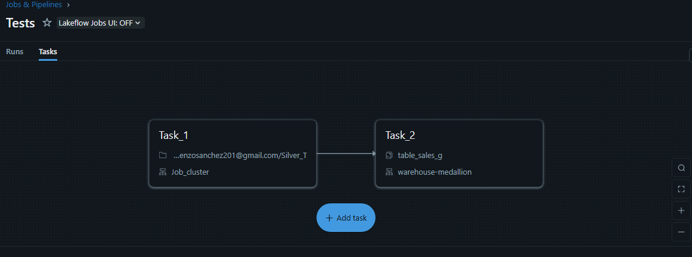
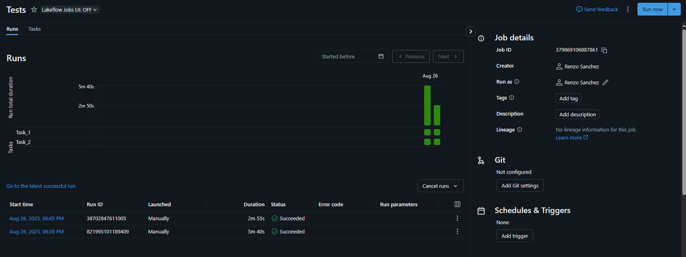
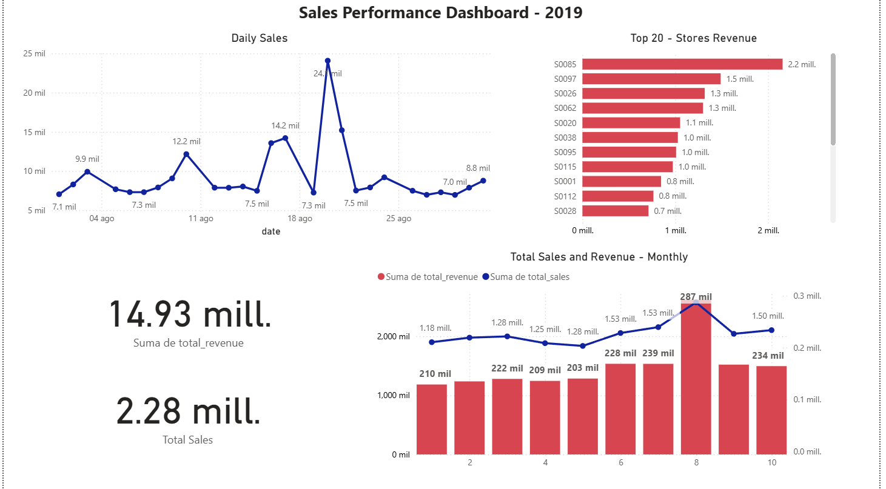

# Databricks Sales Pipeline

## Table of Contents
* [Overview](#overview)
* [Dataset Description](#dataset-description)
* [Technologies](#technologies)
* [Pipeline](#pipeline)
* [Screenshots](#screenshots)

---

## Overview
This project implements an **end-to-end ELT pipeline in Databricks** using the **Medallion Architecture (Bronze–Silver–Gold)** with a retail sales dataset (~19M records).  

The pipeline simulates a **modern data platform**, integrating **ingestion, cleaning, transformation, and visualization** of sales performance in Power BI.  

Objectives:  
- Ingest raw data from CSV (Bronze).  
- Standardize and clean into intermediate tables (Silver).  
- Generate business-ready metrics (Gold).  
- Visualize sales, stock, and promotions in dashboards.  

---

## Dataset Description

| Column                | Type    | Description                      |
|-----------------------|---------|----------------------------------|
| product_id            | string  | Product identifier               |
| store_id              | string  | Store identifier                 |
| date                  | date    | Transaction date                 |
| sales                 | double  | Units sold                       |
| revenue               | double  | Total revenue                    |
| stock                 | double  | Available inventory              |
| price                 | double  | Product price                    |
| promo_type_1          | string  | First promotion type             |
| promo_bin_1           | string  | First promotion flag             |
| promo_type_2          | string  | Second promotion type            |
| promo_bin_2           | string  | Second promotion flag            |
| promo_discount_2      | double  | Discount applied (%)             |
| promo_discount_type_2 | string  | Type of discount applied         |

---

## Technologies
- **Databricks** (PySpark, SQL, Delta Lake)  
- **AWS S3** (raw storage)  
- **Power BI** (KPI visualization)  
- **GitHub** (documentation and version control)  

---

## Pipeline
1. **Bronze:** Raw ingestion from S3.  
2. **Silver:** Cleaning, date formatting, and standardization.  
3. **Gold:** Business tables (sales, revenue, promotions).  
4. **Dashboards:** Sales, stock, and promotion effectiveness analysis.  

---

## Screenshots

### Databricks Pipeline
  
  

### Sales Dashboard (Power BI)
  

---

## Author
**Renzo Gabriel Sánchez Quispe**  
📍 Lima, Peru  
📫 Email: renzosanchez201@gmail.com  
🔗 [GitHub](https://github.com/renzosan25)  
